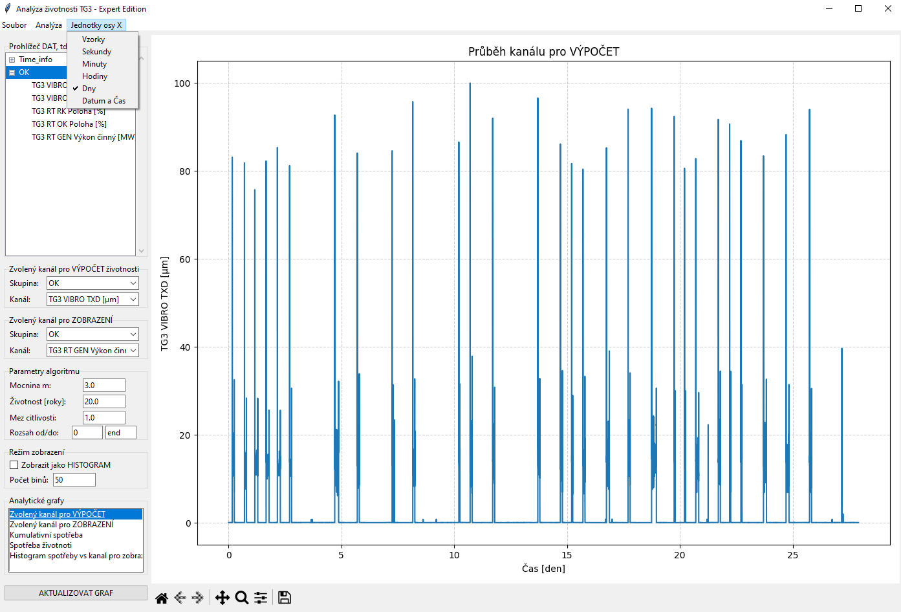

# Life-Analysis
# ⚙️ Analýza životnosti turbogenerátoru

Software pro expertní hodnocení únavového poškození a spotřeby životnosti kritických uzlů na základě provozních dat. Aplikace umožňuje interpretovat naměřené vibrace ve vztahu k provozním parametrům (výkonu) stroje.

# Instalace a spuštění
1. **Příprava prostředí**: Ujistěte se, že máte nainstalovaný Python 3.11+.
2. **Instalace knihoven**:
   ```bash
   pip install -r requirements.txt

   ## 📂 Struktura projektu
* **`src/`**: Zdrojový kód aplikace (`spotreba_zivotnosti_gui.py`).
* **`data/`**: Adresář se vzorovými daty, aplikace podporuje `.tdms` nebo `.csv`.
* **`requirements.txt`**: Seznam závislostí pro správný běh programu.
* **`README.md`**: Tato dokumentace projektu.

## 📖 Uživatelský návod

### Načtení dat
V horním menu zvolte **Soubor -> Načti data**. Program podporuje:
* **TDMS**: Binární formát z NI LabVIEW. Předppokladá že v souboru je kanal "Time".
* **CSV**: Textová data (detekuje středníky i čárky), první sloupec je čas.

### Výběr dat
V levém panelu můžete ovlivnit výpočet a definovat datové zdroje:
* **Zvolený kanál pro VÝPOČET**: Zde vyberte kanál se "zobecněným zatížením". Typicky se jedná o signál vibrací a absolutní (ložiskových), nebo relativních (hřidelových), přednastaven je kanal relativních vibrací (např. TG3 VIBRO TXD [µm]), ze kterého se počítá únavové poškození.
* **Zvolený kanál pro ZOBRAZENÍ**: Tento kanál slouží jako referenční osa pro histogramy. Obvykle se volí činný výkon (MW), aby bylo vidět, při jakém provozním zatížení stroje dochází k největší spotřebě životnosti. Velmi duležitý je spotřeba životnosti při nulovém výkonu. Tata hodnota spotřeby životnosti souvisí s startem a odstavením stroje.
### Nastavení parametrů
* **Mocnina m**: Exponent únavové křivky, který přímo souvisí se sklonem S-N křivky materiálu. (přednastaveno $m=3.0$, může se pohybovat v rozsahu $m=3.0-5.0$).
* **Mez citlivosti**: Hodnota, pod kterou je poškození považováno za nulové vlivem měřeného šumu. Tato mez by měla být nastavena nad hodnotu měřených vibrací pri stojícím stroji.
* **Životnost [roky]**: Celková projektovaná životnost pro kalibraci koeficientů. Běžná hodnota se bude pohybovat v desítkách let. (Přednastaveno 20 let)

### Analytické grafy
Aplikace nabízí několik pohledů:
1. **Kumulativní spotřeba**: Ukazuje, jak se únava sčítá v čase.
2. **Spotřeba životnosti**: Ukazuje spotřebu životnosti v závislosti na čase.
3. **Podíl na spotřebě**: Histogram, který identifikuje, při jakém výkonu (MW) dochází k největšímu poškozování v průběhu měřených zpracovavaných dat. Obvykle bude maximální spotřeba životnosti při nulovém výkonu, toto souvisí se zvýšeným namáháním při startu a při odstavením stroje.
## 🔬 Metodika výpočtu
Program implementuje lineární teorii kumulace poškození (Palmgren-Miner). Spotřeba životnosti $L_i$ pro každý datový bod je definována jako:

$$L_i = \begin{cases} A_i^m \cdot C & \text{pokud } A_i > \text{mez} \\ 0 & \text{pokud } A_i \leq \text{mez} \end{cases}$$

Kde $A_i$ je amplituda signálu a $C$ je konstanta normalizovaná na celkovou dobu provozu.
